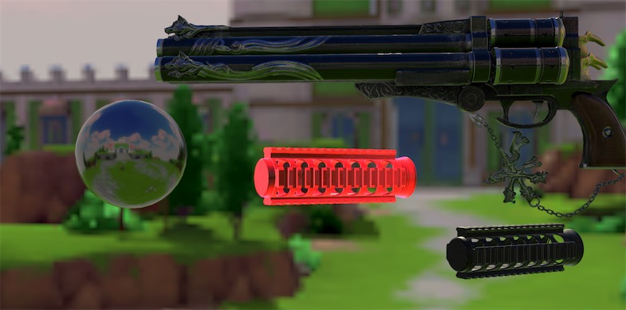
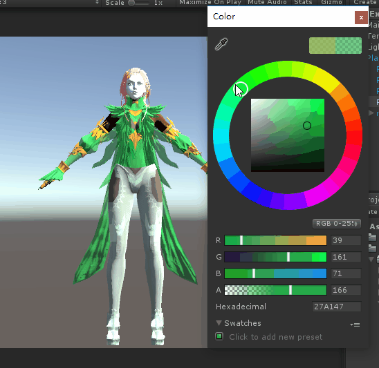

### PBR 渲染 

以metallic 工作流实现的一套简化的pbs,适合在手机移动平台上running。


Shader调试：

选中Shader, 查看DebugMode

1. None     完整的输出(Specular+Diffuse)
2. Diffuse  漫反射颜色输出
3. Specular 高光颜色计算
4. Normal	法线的输出
5. Rim      边缘发光


区别于官方的pbr shader, 我们在render的时候，可以使用一些自定义的选项。虽然这些效果会让渲染出来的结果打破物理计算出来的结果，但是出于美术或者策划这样或者那样的需求，我们还是这样做了。
比如说，我们在保证基于物理计算的同时，还加入了边缘发光的效果。类似的我们还可以附加其他效果。当然，我们也有开关来控制这样效果的显示。


<br><br><br>

我们对PBR使用的公式：

由于移动平台的限制，我们只考虑了主光的计算。基于unity5最新的Enlighten系统，我们在计算时考虑到了直接光照和间接光照。

diffuse:

代码如下：

```hlsl
 NdotL = max(0.0,dot(normalDirection, lightDirection));
half fd90 = 0.5 + 2 * LdotH * LdotH * (1-gloss);
float nlPow5 = Pow5(1-NdotL);
float nvPow5 = Pow5(1-NdotV);
float3 directDiffuse = ((1 +(fd90 - 1)*nlPow5) * (1 + (fd90 - 1)*nvPow5) * NdotL) * attenColor;
float3 indirectDiffuse = float3(0,0,0);
indirectDiffuse += gi.indirect.diffuse;
float3 diffuse = (directDiffuse + indirectDiffuse) * diffuseColor;
```


specular:

很多BRDF模型里的计算，比如微面元法线分布函数(GGXTerm)、微面元遮挡函数(SmithJointGGXVisibilityTerm)、菲涅耳反射(FresnelTerm), 我们直接使用了UnityStandardBRDF.cginc里已经为我们实现好的函数。

BRDF处理镜面反射的公式:

```
// 　　　　　　     D(h) F(v,h) G(l,v,h)
//F(specular) = ---------------------------
// 　　　　　　        4(n·l)(n·v)
```

其中：

#### 微面元法线分布函数 D(h):GGX  

```
//  　　	 alpha^2
//D(m) = -------------------------------
//  　　  pi*((n·m)^2 *(alpha^2-1)+1)^2
```
alpha = roughness * roughness,roughness是粗糙度，roughness= 1-smoothness

<br>

#### 微面元遮挡函数 G(l,v,h)
 Smith-Schlick,在Smith近似下G(l,v,h) = g(l)*g(v)

```
//  　　	  n·v
//g(v) =  ------------------
// 　　　  (n·v) *(1-k) +k
```

k是α基于几何函数是针对直接光照还是针对IBL光照的重映射(Remapping)，k=alpha^2/2, 很多的时候我们直接这里直接传roughness给

<br>

#### 菲涅尔方程 F(v,h):UE4对Schlick的一个近似  

```
//Schlick
//F(v,h) = F0 +(1-F0)*(1-(v·h))^5
//
//UE4 approximation
//
//F(v,h) = F0+(1-F0)2^((-5.55473(v·h)-6.98316)*v·h)
```

h表示用来与平面上微平面做比较用的中间向量，即视野向量和光线方向向量之间的中间向量 vec3 h = normalize(v + l)

F0表示平面的基础反射率，即折射指数(Indices of Refraction)。平面对于法向入射的响应或者说基础反射率可以在一些大型数据库中找到，比如[这个](https://refractiveindex.info/)。下面列举的这一些常见数值就是从Naty Hoffman的课程讲义中所得到的：

<table align="center" border="1" rules=rows><tbody>
    <tr>
        <th style="text-align:center;">材料</th><th style="text-align:center;">(F0) (线性空间)</th><th  style="text-align:center;">(F0) (sRGB)</th>
    </tr>
    <tr>
        <td width="320" align="center" >水</td><td width="320" align="center">(0.02, 0.02, 0.02)</td><td width="320"  align="center">(0.15, 0.15, 0.15) </td>
    </tr>
    <tr>
        <td align="center" >塑料/玻璃（低）</td><td align="center" >(0.03, 0.03, 0.03)</td><td align="center" >(0.21, 0.21, 0.21)</td>
    </tr>
        <tr>
        <td align="center" >塑料（高）</td><td align="center" >(0.05, 0.05, 0.05)</td><td align="center" >(0.24, 0.24, 0.24)</td>
    </tr>
        <tr>
        <td align="center" >玻璃（高）/红宝石</td><td align="center" >(0.08, 0.08, 0.08)</td><td align="center" >(0.31, 0.31, 0.31)</td>
    </tr>
        <tr>
        <td align="center" >钻石</td><td align="center" >(0.17, 0.17, 0.17)</td><td align="center" >(0.45, 0.45, 0.45)</td>
    </tr>
        <tr>
        <td align="center" >铁</td><td align="center" >(0.56, 0.57, 0.58)</td><td align="center" >(0.77, 0.78, 0.78)</td>
    </tr>
        <tr>
        <td align="center" >铜</td><td align="center" >(0.95, 0.64, 0.54)</td><td align="center" >(0.98, 0.82, 0.76)</td>
    </tr>
        <tr>
        <td align="center" >金</td><td align="center" >(1.00, 0.71, 0.29)</td><td align="center" >(1.00, 0.86, 0.57)</td>
    </tr>
        <tr>
        <td align="center" >铝</td><td align="center" >(0.91, 0.92, 0.92)</td><td align="center" >(0.96, 0.96, 0.97)</td>
    </tr>
        <tr>
        <td align="center" >银</td><td align="center" >(0.95, 0.93, 0.88)</td><td align="center" >(0.98, 0.97, 0.95)</td>
    </tr>
</table>


UnityStandardBRDF.cginc放在unity安装目录Editor\Data\CGIncludes下面


<br>


同样的我们使用[LearnOpenGL][i2]中公式实现了一套基于金属流程 PBR的渲染方式， 并和本项目中作对比,  参见 [IBL工程][i3]。

## 染色

<br><br><br>


通过Rendering/Art/Example_ROLE 这个scene查看效果。


染色系统的实现不再基于对纹理简单的采样, 而是程序里自定义颜色。shader的属性里设置了R,G,B 三个通道的颜色，可以通过材质Inspector窗口自定义颜色。piexl shader中去混合这些颜色。


使用这套染色系统，对mesh有一定的要求，需要诸如衣服颜色这些固定颜色的部位使用R,G,B中的一种颜色，里面只有灰度变化。对于像皮肤肉色这种变化的且追求细节的部位，纹理绑定的uv.x区间需要超出1，这部分区域我们不再混合颜色，而是直接对原纹理进行采样。


读者感兴趣的话，可以通过工具QUVEditor uv工具查看。unity的QUVEditor可以在[这里][i1]下载。


<br><br>


[i1]:http://www.qtoolsdevelop.com/
[i2]:https://learnopengl-cn.github.io/07%20PBR/03%20IBL/02%20Specular%20IBL/
[i3]: https://github.com/huailiang/ibl_proj
